<picture>
  <source media="(prefers-color-scheme: dark)" srcset="https://img.shields.io/badge/macOS-14.0+-000000?style=for-the-badge&logo=apple&logoColor=white">
  
</picture>
<picture>
  <source media="(prefers-color-scheme: dark)" srcset="https://img.shields.io/badge/Swift-5.9-FA7343?style=for-the-badge&logo=swift&logoColor=white">
  
</picture>
<picture>
  <source media="(prefers-color-scheme: dark)" srcset="https://img.shields.io/badge/License-MIT-blue?style=for-the-badge">
  
</picture>

# ✨ Mintify

A modern, beautiful macOS storage cleaner and system optimizer. Keep your Mac clean and running smoothly with an intuitive interface.

<table>
<tr>
<td width="31.4%" align="center">
  
</td>
<td width="68.4%" align="center">
  
</td>
</tr>
</table>

### 🔒 Privacy-First Design

> **Sandbox Protected** — Mintify runs in Apple's App Sandbox. No full disk access required.  
> Permissions are requested **only when needed** for specific folders you want to scan.

- ✅ No tracking, no analytics, no data collection
- ✅ Scans only where you allow
- ✅ Open source — verify the code yourself

### 💡 Why Mintify?

| Feature | Mintify | CleanMyMac X |
|---------|:-------:|:------------:|
| **Price** | 🆓 Free | $34.95/year |
| **Open Source** | ✅ Yes | ❌ No |
| **App Size** | 📦 ~3.4 MB | 📦 ~300 MB |
| **Sandbox** | ✅ Protected | ❌ Full Disk Access |
| **Tracking** | ❌ None | ⚠️ Analytics |
| **Native SwiftUI** | ✅ Yes | ❌ AppKit |
| **Menu Bar Mode** | ✅ Lightweight | ⚠️ Heavy |

---

## Features

<table>
<tr>
<td>

### 🧹 Storage Cleaner
**Intelligent junk file detection** across 6 categories:
- User & Browser caches (Safari, Chrome, Firefox)
- System logs & crash reports
- Xcode DerivedData, Archives, Device Support
- Developer tools (npm, yarn, pip, CocoaPods, Homebrew)

*Real-time scanning progress with per-folder breakdown*

</td>
</tr>
<tr>
<td>

### 📁 Large Files Finder
**Customizable threshold scanning** to identify space hogs:
- Filter by size (100MB, 500MB, 1GB, custom)
- Sort by size, name, or modification date
- Category filtering (images, videos, archives, etc.)

*Uses `FileManager` with efficient directory enumeration*

</td>
</tr>
<tr>
<td>

### 📋 Duplicate Finder
**Content-based detection** using MD5 hashing:
- Size-first filtering for performance
- Group duplicates by content hash
- Smart selection (keep original, remove copies)

*Handles large files efficiently with streaming hash*

</td>
</tr>
<tr>
<td>

### 📊 Disk Space Visualizer
**Interactive treemap** of disk usage:
- Drill-down navigation by folder
- Visual size representation
- System vs. user data breakdown

*Uses `URLResourceKey` for accurate size calculation*

</td>
</tr>
<tr>
<td>

### 🧠 Memory Optimizer
**Real-time system monitoring** via Mach APIs:
- Memory pressure & usage stats
- CPU usage per core
- Top processes by memory consumption

*Native `host_statistics64` for accurate metrics*

</td>
</tr>
<tr>
<td>

### 🗑️ App Uninstaller
**Complete removal** including leftovers:
- Application Support files
- Preferences (plist), Caches, Saved States
- Reveal in Finder before deletion

*Scans `/Applications` and `~/Applications`*

</td>
</tr>
</table>

### 📌 Menu Bar Integration
Lightweight **menu bar accessory** with quick access popover:
- System stats at a glance (CPU, RAM, Storage)
- One-click scan trigger
- Opens full app on demand, hides to menu bar when closed

*Built with `NSStatusItem` + SwiftUI `NSHostingController`*

### 📊 Feature Workflows

```mermaid
flowchart LR
    A[Start Scan] --> B{Request Permission}
    B -->|Granted| C[Scan Categories]
    B -->|Denied| D[Skip Folder]
    C --> E[User Caches]
    C --> F[Browser Caches]
    C --> G[Logs]
    C --> H[Xcode]
    C --> I[Dev Tools]
    E & F & G & H & I --> J[Calculate Sizes]
    J --> K[Display Results]
    K --> L{User Selection}
    L --> M[Clean Selected]
    M --> N[✓ Done]
```

<details>
<summary><b>🧹 Storage Cleaner Flow</b></summary>



</details>

<details>
<summary><b>📋 Duplicate Finder Flow</b></summary>



</details>

<details>
<summary><b>🗑️ App Uninstaller Flow</b></summary>

```mermaid
flowchart LR
    A[Select Folders] --> B{Request Permission}
    B -->|Granted| C[Enumerate Files]
    C --> D[Group by Size]
    D --> E[Filter Same Size]
    E --> F[Calculate MD5 Hash]
    F --> G[Group by Hash]
    G --> H[Display Duplicates]
    H --> I{User Selection}
    I --> J[Delete Copies]
    J --> K[✓ Done]
```

```mermaid
flowchart LR
    A[Scan Apps] --> B[/Applications]
    A --> C[~/Applications]
    B & C --> D[List Installed Apps]
    D --> E{Select App}
    E --> F[Find Leftovers]
    F --> G[App Support]
    F --> H[Preferences]
    F --> I[Caches]
    F --> J[Saved States]
    G & H & I & J --> K[Show All Files]
    K --> L{Confirm Delete}
    L --> M[Move to Trash]
    M --> N[✓ Done]
```

</details>

---

## Installation

### Requirements
- macOS 14.0+ (Sonoma or later)
- Xcode 15.0+ (for building from source)

### Build from Source

1. **Install XcodeGen**
   ```bash
   brew install xcodegen
   ```

2. **Clone the repository**
   ```bash
   git clone https://github.com/YOUR_USERNAME/Mintify.git
   cd Mintify
   ```

3. **Generate Xcode project**
   ```bash
   xcodegen generate
   ```

4. **Open and build**
   ```bash
   open Mintify.xcodeproj
   ```
   Then press `⌘R` to build and run.

---

## Usage

After launching, Mintify runs in the menu bar. Click the ✨ icon to:
- View system stats
- Quick scan for junk files
- Access the full application

### Full Application

Click "Open Mintify" to access all features:
- **Cleaner**: Scan and clean cached files
- **Large Files**: Find space-consuming files
- **Duplicates**: Detect duplicate content
- **Disk Space**: Visualize storage usage
- **Memory**: Monitor RAM
- **Uninstaller**: Remove apps completely

---

## Project Structure

```
Mintify/
├── App/              # AppDelegate, MainTab
├── States/           # Observable state classes
├── Views/            # SwiftUI views (feature-based)
│   ├── Shared/       # Reusable components
│   ├── Cleaner/      # Storage cleaner views
│   ├── Duplicates/   # Duplicate finder views
│   └── ...
├── Services/         # Scanners and business logic
├── Models/           # Data models
└── docs/             # Documentation
```

See [docs/ARCHITECTURE.md](docs/ARCHITECTURE.md) for detailed architecture.

---

## Documentation

| Document | Description |
|----------|-------------|
| [Architecture](docs/ARCHITECTURE.md) | System architecture and code organization |
| [Features](docs/FEATURES.md) | Detailed feature documentation |
| [Development](docs/DEVELOPMENT.md) | Development setup guide |
| [Contributing](docs/CONTRIBUTING.md) | Contribution guidelines |

---

## Contributing

Contributions are welcome! Please read our [Contributing Guide](docs/CONTRIBUTING.md) for details.

1. Fork the repository
2. Create a feature branch
3. Make your changes
4. Submit a pull request

---

### About This Project

Mintify was born from frustration with bloated, ad-filled Mac cleaners that don't respect your privacy or system. This is a **100% native SwiftUI app** with:
- 🔒 **Sandbox protected** — no full disk access required
- 🚫 No tracking, no ads, no subscriptions
- 📖 Open source and transparent
- ⚡️ Built for developers who appreciate clean code

---

## Contributors

Thanks to everyone who has contributed to Mintify! 🎉

<!-- ALL-CONTRIBUTORS-LIST:START -->
<!-- Empty for now -->
<!-- ALL-CONTRIBUTORS-LIST:END -->

**Want to contribute?** Check out our [Contributing Guide](docs/CONTRIBUTING.md) to get started!

---

## Author


*Yellow Studio Labs*

📧 [yellowstudio.vn@gmail.com](mailto:yellowstudio.vn@gmail.com)  

## License

This project is licensed under the MIT License - see the [LICENSE](LICENSE) file for details.

---

<p align="center">
  <b>Yellow Studio Labs</b> • Made with ✨ for the world
</p>
