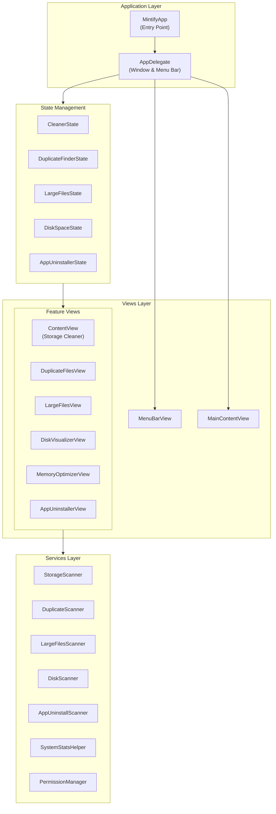
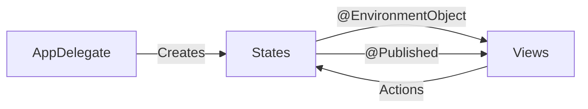
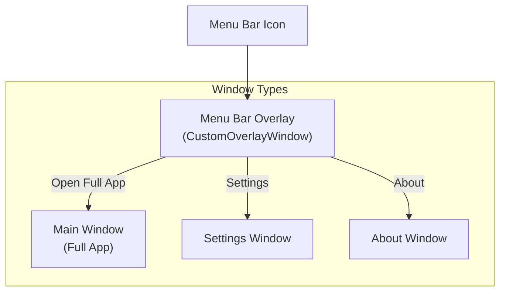

# Architecture Overview

This document describes the architecture and code organization of Mintify.

## System Architecture



## Project Structure

```
Mintify/
├── MintifyApp.swift          # @main entry point (minimal)
│
├── App/                      # Application layer
│   ├── AppDelegate.swift     # Window management, menu bar
│   ├── MainTab.swift         # Tab navigation enum
│   └── CustomOverlayWindow.swift
│
├── States/                   # ObservableObject state classes
│   ├── CleanerState.swift
│   ├── DuplicateFinderState.swift
│   ├── LargeFilesState.swift
│   ├── DiskSpaceState.swift
│   └── AppUninstallerState.swift
│
├── Views/                    # SwiftUI Views (feature-based)
│   ├── Shared/              # Reusable components
│   │   ├── AppTheme.swift
│   │   ├── CircularProgressView.swift
│   │   └── ...
│   │
│   ├── Cleaner/             # Storage Cleaner feature
│   ├── Duplicates/          # Duplicate Finder feature
│   ├── LargeFiles/          # Large Files feature
│   ├── DiskVisualizer/      # Disk Space Visualizer
│   ├── MemoryOptimizer/     # Memory Optimizer
│   ├── AppUninstaller/      # App Uninstaller
│   ├── MenuBar/             # Menu bar popup
│   ├── Settings/            # Settings & About
│   └── Main/                # Main window
│
├── Services/                 # Business logic & scanning
│   ├── StorageScanner.swift
│   ├── DuplicateScanner.swift
│   ├── LargeFilesScanner.swift
│   ├── DiskScanner.swift
│   ├── AppUninstallScanner.swift
│   ├── SystemStatsHelper.swift
│   └── PermissionManager.swift
│
├── Models/                   # Data models
│   ├── CleanableItem.swift
│   ├── DuplicateFile.swift
│   ├── LargeFile.swift
│   ├── DiskItem.swift
│   └── AppInfo.swift
│
├── Extensions/               # Swift extensions
├── Helpers/                  # Helper utilities
└── Assets.xcassets/          # App icons & assets
```

## State Management

Mintify uses SwiftUI's `@EnvironmentObject` pattern for state management:



Each feature has its own state class:
- **CleanerState**: Storage cleaner scan/clean state
- **DuplicateFinderState**: Duplicate file detection
- **LargeFilesState**: Large file finder
- **DiskSpaceState**: Disk visualization
- **AppUninstallerState**: Application uninstaller

## Window Architecture



## Key Design Decisions

1. **Menu Bar First**: App runs as menu bar accessory by default, showing dock icon only when windows are open
2. **Feature-based Folder Structure**: Views organized by feature for better maintainability
3. **Separate State Classes**: Each feature has isolated state, reducing coupling
4. **Minimal Entry Point**: `MintifyApp.swift` is just the `@main` entry, all logic in separate files
