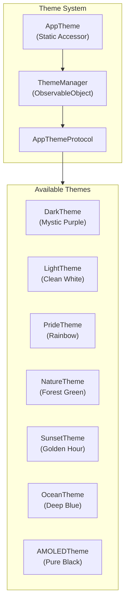

# Theme System

Mintify features a robust theming system that allows users to customize the app's appearance with 7 built-in themes.

## Architecture



## File Structure

```
Mintify/Views/Shared/
├── ThemeManager.swift      # Singleton managing theme state
├── AppThemeProtocol.swift  # Protocol + ThemeType enum
└── Themes/
    ├── DarkTheme.swift     # Mystic Purple (Default)
    ├── LightTheme.swift    # Clean White
    ├── PrideTheme.swift    # Rainbow Gradient
    ├── NatureTheme.swift   # Forest Green
    ├── SunsetTheme.swift   # Golden Hour
    ├── OceanTheme.swift    # Deep Blue
    └── AMOLEDTheme.swift   # Pure Black
```

## Core Components

### ThemeManager

Singleton `ObservableObject` that manages theme selection and persistence.

```swift
class ThemeManager: ObservableObject {
    static let shared = ThemeManager()
    
    @Published var currentTheme: AppThemeProtocol
    @AppStorage("selectedTheme") private var selectedThemeId: String
    
    func switchTheme(to themeType: ThemeType) { ... }
}
```

### AppThemeProtocol

Protocol defining all required theme properties:

| Category | Properties |
|----------|------------|
| **Backgrounds** | `mainBackground` (LinearGradient) |
| **Text** | `textPrimary`, `textSecondary` |
| **Cards** | `cardBackground`, `cardBorder` |
| **Overlays** | `overlayLight`, `overlayMedium`, `overlayHeavy` |
| **Sidebar** | `sidebarBackground` |
| **Accents** | `cleanPink`, `cleanCyan` |
| **Gradients** | `storageGradient`, `memoryGradient`, `cpuGradient`, `mintifyGradient`, `primaryActionGradient` |

### AppTheme (Static Accessor)

Provides backward-compatible static access to current theme properties:

```swift
// Usage in views
AppTheme.mainBackground
AppTheme.textPrimary
AppTheme.cardBackground
```

## Usage in Views

### Making Views Theme-Reactive

Add `@ObservedObject` to observe theme changes:

```swift
struct MyView: View {
    @ObservedObject var themeManager = ThemeManager.shared
    
    var body: some View {
        Text("Hello")
            .foregroundColor(AppTheme.textPrimary)
            .background(AppTheme.cardBackground)
    }
}
```

### Switching Themes

```swift
ThemeManager.shared.switchTheme(to: .ocean)
```

### Getting Current Theme Type

```swift
let currentType = ThemeManager.shared.currentThemeType // ThemeType enum
```

## Available Themes

| Theme | ID | Description | Background Colors |
|-------|-----|-------------|-------------------|
| Dark | `dark` | Mystic Purple | `#2A1B3D` → `#44318D` |
| Light | `light` | Clean White | `#F8FAFC` → `#E2E8F0` |
| Pride | `pride` | Rainbow Gradient | `#FF6B6B` → `#4ECDC4` |
| Nature | `nature` | Forest Green | `#1B4332` → `#2D6A4F` |
| Sunset | `sunset` | Golden Hour | `#2D1F3D` → `#6B2D5B` |
| Ocean | `ocean` | Deep Blue | `#0A1628` → `#1E3A5F` |
| AMOLED | `amoled` | Pure Black | `#000000` → `#0A0A0A` |

## Creating a New Theme

1. Create a new file in `Themes/` folder:

```swift
import SwiftUI

struct MyCustomTheme: AppThemeProtocol {
    // MARK: - Backgrounds
    var mainBackground: LinearGradient {
        LinearGradient(
            colors: [Color(hex: "XXXXXX"), Color(hex: "YYYYYY")],
            startPoint: .topLeading,
            endPoint: .bottomTrailing
        )
    }
    
    // MARK: - Text Colors
    var textPrimary: Color { .white }
    var textSecondary: Color { .white.opacity(0.7) }
    
    // ... implement all required properties
}
```

2. Add to `ThemeType` enum in `AppThemeProtocol.swift`:

```swift
enum ThemeType: String, CaseIterable, Identifiable {
    // ... existing cases
    case myCustom = "My Custom"
    
    var icon: String {
        // ... add case
    }
    
    var description: String {
        // ... add case
    }
    
    func createTheme() -> AppThemeProtocol {
        // ... add case
        case .myCustom: return MyCustomTheme()
    }
}
```

## Best Practices

1. **Always use `AppTheme` static properties** instead of hardcoded colors
2. **Add `@ObservedObject themeManager`** to views that need instant theme updates
3. **Test with Light theme** to ensure good contrast and visibility
4. **Use semantic color names** (`textPrimary` vs `white`) for theme compatibility
